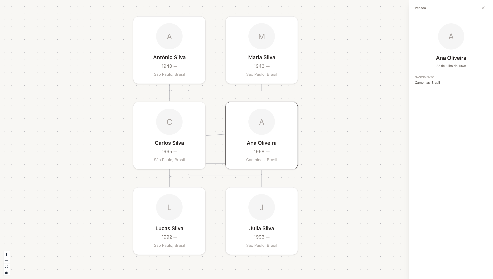

# Family Tree 🌳

An interactive family tree application built with React, TypeScript, and React Flow.

The project provides an interactive way to visualize family relationships and explore information about each family member.

## Preview



## Tech Stack

- React
- TypeScript
- Vite
- React Flow
- Tailwind CSS
- Zustand
- Lucide React
- ESLint
- Prettier

## Features

- Interactive family tree visualization
- Custom person cards
- Family relationship connections
- Person selection
- Person details panel
- Zoom and pan navigation
- Automatic family tree layout

## Getting Started

### Install dependencies

```bash
pnpm install
```

### Run the development server

```bash
pnpm dev
```

The application will be available at:

```text
http://localhost:5173
```

## Available Scripts

```bash
pnpm dev
pnpm build
pnpm lint
pnpm format
pnpm format:check
pnpm preview
```

## Project Structure

```text
src/
├── components/
│   ├── FamilyConnector/
│   ├── FamilyTree/
│   ├── PersonCard/
│   └── PersonDetails/
├── data/
├── pages/
├── stores/
├── types/
└── utils/
```

## Project Status

🚧 **Work in progress**

This project is currently under development. New features and improvements will be added as the family tree system evolves.
